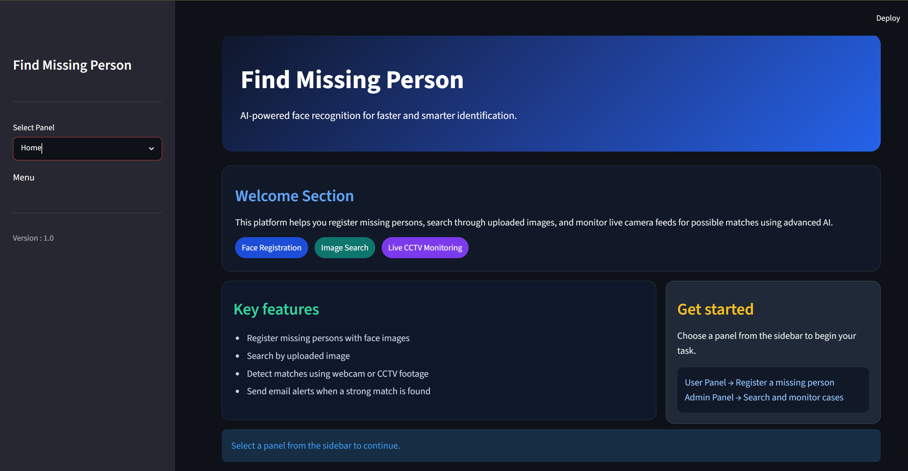
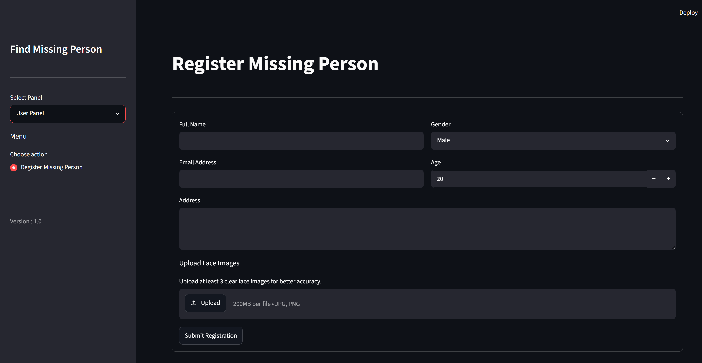
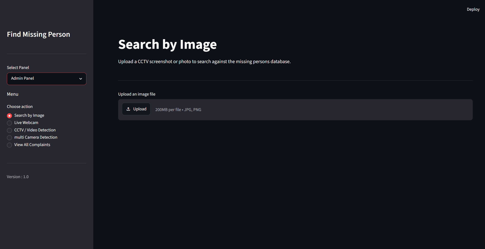
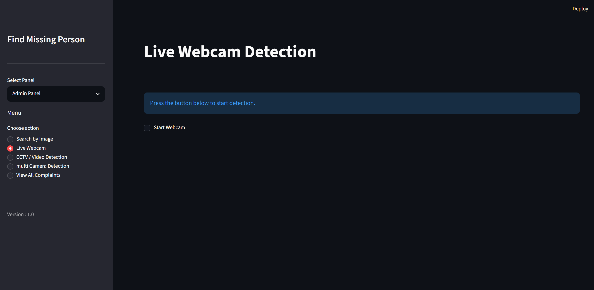
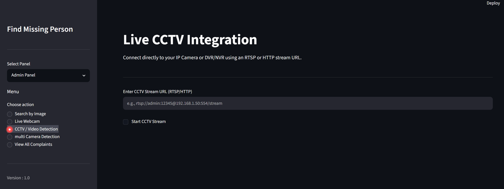

# AI Powered Missing Person Identification System

> **An AI-powered real-time missing person identification system using YOLOv8, InsightFace, OpenCV, Streamlit, and SQLite.**


---

## 📖 Project Overview

The **AI Powered Missing Person Identification System** is an intelligent face recognition application designed to assist in locating missing persons using **Artificial Intelligence, Deep Learning, and Computer Vision**.

The system detects faces from **images, videos, webcams, and CCTV camera feeds**, generates facial embeddings using **InsightFace**, and compares them with registered missing person records using **Cosine Similarity**. A user-friendly **Streamlit** interface enables easy registration, searching, and real-time monitoring.

---

## 📌 Problem Statement

Every year, thousands of people go missing, making it difficult for law enforcement agencies and families to locate them quickly. Traditional identification methods rely heavily on manual observation, which is time-consuming, error-prone, and inefficient when dealing with large volumes of CCTV footage or video surveillance.

This project aims to develop an **AI-powered Missing Person Identification System** that automatically detects and identifies missing persons from images, recorded videos, live webcam streams, and CCTV feeds. By leveraging **Deep Learning**, **Computer Vision**, and **Face Recognition**, the system provides a faster, more accurate, and automated approach to missing person identification.

---

## ✨ Key Features

- 👤 Register Missing Person Details
- 🧠 Face Detection using YOLOv8
- 😊 Face Embedding Generation using InsightFace
- 🔍 Face Matching using Cosine Similarity
- 🖼️ Search Using Image Upload
- 🎥 Video File Detection
- 📷 Live Webcam Detection
- 📹 CCTV Camera Detection
- 🎦 Multi-Camera Monitoring
- 📧 Email Notification on Successful Match
- 🗄️ SQLite Database Integration
- 💻 Interactive Streamlit Dashboard

---

## 🎓 Internship Training Details

This project was developed during the **Foundations of AI & ML Internship Program** conducted at **Centre for Development of Advanced Computing (C-DAC), Patna**.

The internship focused on building practical knowledge of **Artificial Intelligence, Machine Learning, Deep Learning** through hands-on training and real-world project development.

### Internship Details

| Particular | Details |
|------------|---------|
| Organization | Centre for Development of Advanced Computing (C-DAC), Patna |
| Training Program | Foundations of AI & ML |
| Duration | 08 June 2026 – 10 July 2026 |
| Grade | A+ |
| Project | AI Powered Missing Person Identification System |

---

## 🛠️ Technology Stack

| Category | Technologies |
|----------|--------------|
| Programming Language | Python |
| Frontend | Streamlit |
| Object Detection | YOLOv8 (Ultralytics) |
| Face Recognition | InsightFace |
| Computer Vision | OpenCV |
| Machine Learning | Scikit-Learn |
| Database | SQLite |
| Numerical Computing | NumPy |

---

## 🏗️ System Workflow

```
                    Register Missing Person
                              │
                              ▼
                   Store Person Information
                              │
                              ▼
                 Generate Face Embeddings
                              │
                              ▼
                     Store in SQLite Database
                              │
                              ▼
        ------------------------------------------------
        │                    │                      │
        ▼                    ▼                      ▼
   Image Upload        Live Webcam           CCTV Camera
        │                    │                      │
        └────────────────────┼──────────────────────┘
                             ▼
                 Face Detection (YOLOv8)
                             ▼
             Face Embedding (InsightFace)
                             ▼
              Cosine Similarity Comparison
                             ▼
                   Match Found / No Match
                             ▼
          Display Result & Send Email Notification
```

---

## 📂 Project Structure

```
MISSING_PERSON_IDENTIFICATION_SYSTEM/
│
├── app.py
├── home.py
├── admin_panel.py
├── user_panel.py
├── database.py
├── config.py
├── cctv_module.py
├── multi_camera_module.py
├── face_detector.py
├── face_embedder.py
├── face_recognizer.py
├── email_notifier.py
├── requirements.txt
├── README.md
├── .gitignore
│
├── model/
├── embeddings/
├── known_faces/
└── assets/
```

---

## ⚙️ Installation

### 1️⃣ Clone the Repository

```bash
git clone https://github.com/your-username/AI-Powered-Missing-Person-Identification-System.git
```

```bash
cd AI-Powered-Missing-Person-Identification-System
```

---

### 2️⃣ Create Virtual Environment

**Windows**

```bash
python -m venv venv
venv\Scripts\activate
```

**Linux / macOS**

```bash
python3 -m venv venv
source venv/bin/activate
```

---

### 3️⃣ Install Required Packages

```bash
pip install -r requirements.txt
```

---

## ▶️ Run the Project

```bash
streamlit run app.py
```

Open your browser and visit:

```
http://localhost:8501
```

---

## 🔄 Working Process

1. Register a Missing Person
2. Save Person Details in SQLite Database
3. Generate Face Embeddings
4. Upload Image / Video or Start Webcam/CCTV
5. Detect Face using YOLOv8
6. Generate Face Embedding using InsightFace
7. Compare with Registered Embeddings
8. Display Matching Result
9. Send Email Notification (If Match Found)

---

## 📸 Screenshots

### 🏠 Home Page



---

### 👤 Register Missing Person



---

### 🖼️ Image Detection



---

### 📷 Live Webcam Detection



---

### 📹 CCTV Detection




---

### 📊 Model Training Results


---

## 🚀 Future Enhancements

- Cloud Database Integration
- Mobile Application Support
- Face Tracking
- Multiple Face Recognition
- GPS-Based Location Tracking
- REST API Integration
- Docker Deployment
- Faster Real-Time Processing
- User Authentication & Role Management
- Detection History Dashboard

---

## 🎓 Acknowledgements & Team

This **AI Powered Missing Person Identification System** was successfully developed as part of the **C-DAC Patna – Foundations of AI & ML Internship Program**.

The project was built through collaborative teamwork, with members contributing to different modules, AI model development, system integration, testing, and deployment.

We sincerely express our heartfelt gratitude to our mentors for their continuous guidance, valuable suggestions, and technical support throughout the project.

### 👨‍🏫 Mentors

- **Ms. Bidakshita Dhoke**
- **Mr. Manas Panigrahi**

Their mentorship played a significant role in the successful completion of this project.

### 👨‍💻 Development Team (C-DAC Patna Interns)

- **Abhishek kumar** — Team Leader ( Model Integration, Face Recognition Pipeline, Streamlit Integration & System Implementation )
- **Anand Kumar** — AI Model Development( Model Training )
- **Rupam Kumari** — Backend Developer
- **Chandani Kumari** — Email Integration
- **Sneha Kumari** — Frontend Developer

Special thanks to every team member for their dedication, collaboration, and valuable contributions throughout the development lifecycle.

---

## 📄 License

This project was developed for **educational and research purposes** as part of the **C-DAC Patna – Foundations of AI & ML Internship Program**.

The source code is shared for learning, academic, and demonstration purposes. Feel free to explore, study, and build upon this project with proper acknowledgment to the original authors.

---

## 📬 Contact

**Abhishek Kumar**

- 🎓 B.Tech (Computer Science & Engineering)
- 🏫 Rashtrakavi Ramdhari Singh Dinkar College of Engineering, Begusarai
- 💼 C-DAC Patna Intern
- 💻 GitHub: [https://github.com/Iamabhi315](https://github.com/Iamabhi315)
- 📧 Email:  ak95722352@gmail.com

---

⭐ **If you found this project useful, consider giving it a Star on GitHub!**
